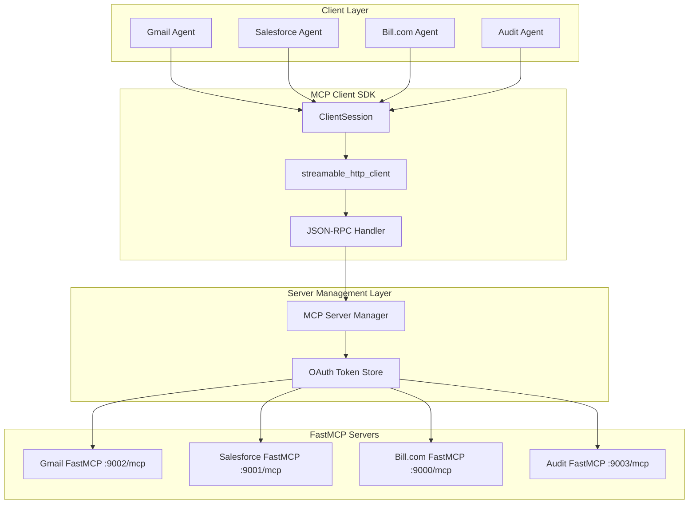

# MCP HTTP Transport Migration Design

## Overview

This design document outlines the migration from STDIO transport to HTTP transport for MCP (Model Context Protocol) communications using the **FastMCP** framework. The current STDIO-based architecture creates subprocess management conflicts when multiple clients attempt to connect to the same server or when servers are already running independently.

The HTTP transport solution uses **FastMCP** for both servers (with `@mcp.tool()` decorators) and clients (with the `Client` class). This allows MCP servers to run as independent services that multiple clients can connect to concurrently without subprocess conflicts, while maintaining full MCP protocol compliance.

**Key Benefits**: This design uses FastMCP's simplified patterns - `@mcp.tool()` decorators for servers and `Client(server_url)` for clients - ensuring proper JSON-RPC protocol compliance and OAuth session management without manual session handling.

## Architecture

### Current State Analysis

**STDIO Transport Issues:**
- Each MCP client starts its own server subprocess using `StdioServerParameters`
- Multiple clients cannot share the same server instance
- Subprocess lifecycle management creates conflicts and resource leaks
- Asyncio task management issues when servers are already running
- No support for concurrent client connections to the same server
- **OAuth Problem**: STDIO transport cannot handle OAuth flows that require persistent sessions and token management

**Affected Components:**
- `backend/app/agents/gmail_agent.py` - Uses `GmailStandardMCPClient` with STDIO
- `backend/app/agents/salesforce_agent.py` - Uses STDIO MCP clients
- `backend/app/agents/bill_com_agent.py` - Uses STDIO MCP clients
- `backend/app/services/mcp_client.py` - Base STDIO client implementation
- `src/mcp_server/*.py` - MCP servers that need HTTP transport support

### Target Architecture (Using Correct MCP SDK)



**Key Improvements:**

1. **FastMCP Servers**: Uses `@mcp.tool()` decorators for simple tool definition
2. **ClientSession**: Uses correct `ClientSession + streamable_http_client` pattern
3. **Single `/mcp` Endpoint**: Each server automatically exposes `/mcp` endpoint
4. **OAuth Support**: Simple token storage in server memory for MVP
5. **No Custom JSON-RPC**: SDK handles all protocol details

## Components and Interfaces

### 1. MCP Server Using FastMCP

**Correct FastMCP Server Implementation:**
```python
from fastmcp import FastMCP  # ✅ CORRECT IMPORT
import asyncio
from typing import Dict, Any

# Create FastMCP server instance
mcp = FastMCP("gmail-server")

# Simple OAuth token storage (use proper storage in production)
_oauth_tokens = {}

@mcp.tool()
async def gmail_authenticate() -> str:
    """Start Gmail OAuth flow."""
    auth_url = await _generate_oauth_url()
    return f"Please visit: {auth_url}"

@mcp.tool()
async def gmail_list_messages(max_results: int = 10, query: str = "") -> str:
    """List Gmail messages (requires authentication)."""
    if not _oauth_tokens:
        return "Error: Not authenticated. Call gmail_authenticate first."
    
    messages = await _fetch_gmail_messages(_oauth_tokens, max_results, query)
    return f"Found {len(messages)} messages"

@mcp.tool()
async def gmail_send_message(to: str, subject: str, body: str) -> str:
    """Send a Gmail message."""
    if not _oauth_tokens:
        return "Error: Not authenticated."
    
    message_id = await _send_gmail_message(_oauth_tokens, to, subject, body)
    return f"Message sent! ID: {message_id}"

@mcp.tool()
async def gmail_oauth_callback(code: str) -> str:
    """Handle OAuth callback."""
    tokens = await _exchange_oauth_code(code)
    _oauth_tokens.update(tokens)
    return "Authentication successful!"

# Helper functions
async def _generate_oauth_url() -> str:
    """Generate OAuth authorization URL."""
    return "https://accounts.google.com/oauth/authorize?..."

async def _fetch_gmail_messages(tokens: dict, max_results: int, query: str) -> list:
    """Fetch Gmail messages using API."""
    return []

async def _send_gmail_message(tokens: dict, to: str, subject: str, body: str) -> str:
    """Send Gmail message using API."""
    return "msg_123"

async def _exchange_oauth_code(code: str) -> dict:
    """Exchange OAuth code for tokens."""
    return {"access_token": "...", "refresh_token": "..."}

if __name__ == "__main__":
    # Start server with HTTP transport
    mcp.run(transport="http", host="0.0.0.0", port=9002)
```

### 2. MCP Client Using FastMCP

**Correct FastMCP Client Implementation:**
```python
import asyncio
from fastmcp import Client  # ✅ CORRECT IMPORT

class GmailAgent:
    """Simple Gmail agent using FastMCP Client."""
    
    def __init__(self, server_url: str = "http://localhost:9002/mcp"):
        self.client = Client(server_url)
    
    async def __aenter__(self):
        await self.client.__aenter__()
        return self
    
    async def __aexit__(self, *args):
        await self.client.__aexit__(*args)
    
    async def authenticate(self) -> str:
        """Start OAuth authentication."""
        result = await self.client.call_tool("gmail_authenticate", {})
        return result
    
    async def complete_auth(self, code: str) -> str:
        """Complete OAuth with code."""
        result = await self.client.call_tool("gmail_oauth_callback", {"code": code})
        return result
    
    async def list_messages(self, max_results: int = 10) -> str:
        """List Gmail messages."""
        result = await self.client.call_tool("gmail_list_messages", {
            "max_results": max_results
        })
        return result
    
    async def send_message(self, to: str, subject: str, body: str) -> str:
        """Send Gmail message."""
        result = await self.client.call_tool("gmail_send_message", {
            "to": to,
            "subject": subject,
            "body": body
        })
        return result

# Usage example
async def main():
    async with GmailAgent() as agent:
        auth_url = await agent.authenticate()
        print(auth_url)
        
        messages = await agent.list_messages(5)
        print(messages)

if __name__ == "__main__":
    asyncio.run(main())
```

### 3. Server Manager

**Server Lifecycle Management:**
```python
import subprocess
import os
from typing import Dict

class MCPServerManager:
    """Manages lifecycle of FastMCP servers."""
    
    def __init__(self):
        self.processes = {}
    
    def start_server(self, name: str, script_path: str, port: int):
        """Start MCP server as subprocess."""
        env = {**os.environ, "PORT": str(port)}
        process = subprocess.Popen(["python3", script_path], env=env)
        self.processes[name] = process
        print(f"✅ Started {name} on port {port}")
    
    def start_all_servers(self):
        """Start all servers."""
        self.start_server("gmail", "src/mcp_server/gmail_server.py", 9002)
        self.start_server("salesforce", "src/mcp_server/salesforce_server.py", 9001)
        self.start_server("bill_com", "src/mcp_server/bill_com_server.py", 9000)
    
    def stop_all_servers(self):
        """Stop all servers."""
        for name, process in self.processes.items():
            process.terminate()
            process.wait()
            print(f"✅ Stopped {name}")
```

### 4. Multi-Service Agent

**Agent Using Multiple Services:**
```python
from fastmcp import Client  # ✅ CORRECT IMPORT
from typing import Dict, Any

class MultiServiceAgent:
    """Agent that uses multiple MCP services."""
    
    def __init__(self):
        self.clients = {
            "gmail": Client("http://localhost:9002/mcp"),
            "salesforce": Client("http://localhost:9001/mcp"),
            "bill_com": Client("http://localhost:9000/mcp")
        }
    
    async def __aenter__(self):
        for client in self.clients.values():
            await client.__aenter__()
        return self
    
    async def __aexit__(self, *args):
        for client in self.clients.values():
            await client.__aexit__(*args)
    
    async def send_email(self, to: str, subject: str, body: str) -> str:
        """Send email via Gmail."""
        return await self.clients["gmail"].call_tool("gmail_send_message", {
            "to": to, "subject": subject, "body": body
        })
    
    async def get_salesforce_accounts(self, limit: int = 5) -> str:
        """Get Salesforce accounts."""
        return await self.clients["salesforce"].call_tool("salesforce_get_accounts", {
            "limit": limit
        })
    
    async def search_invoices(self, query: str) -> str:
        """Search Bill.com invoices."""
        return await self.clients["bill_com"].call_tool("bill_com_search_invoices", {
            "query": query
        })

# Usage
async def main():
    async with MultiServiceAgent() as agent:
        email_result = await agent.send_email("user@example.com", "Test", "Hello!")
        accounts = await agent.get_salesforce_accounts(3)
        invoices = await agent.search_invoices("pending")
        
        print(f"Email: {email_result}")
        print(f"Accounts: {accounts}")
        print(f"Invoices: {invoices}")
```

*A property is a characteristic or behavior that should hold true across all valid executions of a system-essentially, a formal statement about what the system should do. Properties serve as the bridge between human-readable specifications and machine-verifiable correctness guarantees.*

## Correctness Properties

**Property 1: FastMCP Tool Registration**
*For any* tool defined with `@mcp.tool()` decorator, it must be automatically available via the MCP protocol without manual registration
**Validates: Requirements 1.1, 1.2**

**Property 2: FastMCP Client Connection**
*For any* MCP server URL, `Client(server_url)` must establish proper connection to the `/mcp` endpoint
**Validates: Requirements 2.1**

**Property 3: Tool Call Protocol Compliance**
*For any* tool call via `client.call_tool()`, the request must use proper JSON-RPC format and return string results
**Validates: Requirements 2.2, 3.2**

**Property 4: OAuth Token Persistence**
*For any* OAuth tokens stored in server memory, they must persist for the duration of the server process
**Validates: Requirements 8.1, 8.2**

**Property 5: Concurrent Client Support**
*For any* number of simultaneous FastMCP client connections, the server must handle each independently
**Validates: Requirements 1.5, 3.3**

**Property 6: Server Process Independence**
*For any* FastMCP client connection, the client must not start or manage server subprocesses
**Validates: Requirements 2.1, 3.1**

**Property 7: Transport Layer Abstraction**
*For any* agent tool call, the interface must remain identical whether using STDIO or HTTP transport
**Validates: Requirements 3.4, 9.5**

**Property 8: Session Cleanup**
*For any* client disconnection, server resources must be cleaned up without affecting other sessions
**Validates: Requirements 2.5, 4.2**

**Property 9: Error Handling Consistency**
*For any* tool execution error, the response must be returned as a string rather than raising exceptions
**Validates: Requirements 6.1, 6.2**

**Property 10: Server Manager Process Control**
*For any* server started by the manager, it must run as an independent subprocess that can be stopped cleanly
**Validates: Requirements 4.1, 4.2**

## Error Handling

### Simplified Error Types
```python
class MCPTransportError(Exception):
    """Base exception for MCP transport errors."""
    def __init__(self, message: str, service_name: str = None):
        self.service_name = service_name
        super().__init__(message)

class MCPConnectionError(MCPTransportError):
    """Raised when MCP connection fails."""
    pass

class MCPOAuthError(MCPTransportError):
    """Raised when OAuth authentication fails."""
    pass
```

## Testing Strategy

### Unit Testing

**Test Categories:**
- FastMCP server startup and tool registration
- FastMCP Client connection and tool calling
- OAuth flow integration
- Server manager process control
- Agent integration with multiple services

**Key Test Cases:**
```python
class TestFastMCPIntegration:
    def test_fastmcp_server_startup(self):
        """Verify FastMCP servers start and expose /mcp endpoint."""
        
    def test_tool_decorator_registration(self):
        """Verify @mcp.tool() decorators register tools automatically."""
        
    def test_fastmcp_client_connection(self):
        """Verify FastMCP Client connects to servers."""
        
    def test_oauth_token_storage(self):
        """Verify OAuth tokens persist in server memory."""

class TestServerManager:
    def test_subprocess_management(self):
        """Verify server manager starts/stops subprocesses correctly."""
        
    def test_multiple_server_startup(self):
        """Verify multiple servers can run on different ports."""
```

### Integration Testing

**End-to-End Scenarios:**
- Complete OAuth flow with FastMCP server
- Multi-client connections to same FastMCP server
- Agent workflow using multiple MCP services
- Server restart with client reconnection

## Implementation Strategy

### Phase 1: FastMCP Server Migration
1. Install FastMCP SDK: `pip install fastmcp`
2. Convert existing servers to use FastMCP with `@mcp.tool()` decorators
3. Implement simple OAuth token storage in memory
4. Test server startup with `mcp.run(transport="http", host="0.0.0.0", port=9002)`
5. Verify `/mcp` endpoint responds to JSON-RPC requests

### Phase 2: Client Migration
1. Replace custom clients with FastMCP `Client`
2. Update agent base classes to use `Client(server_url)` pattern
3. Test tool calling via `client.call_tool()`
4. Verify proper connection cleanup with context managers
5. Test concurrent client connections

### Phase 3: Agent Integration
1. Update existing agents (Gmail, Salesforce, Bill.com)
2. Maintain identical tool calling interfaces for agents
3. Test multi-service agent workflows
4. Performance testing and optimization
5. Error handling and retry logic

### Phase 4: Production Preparation
1. Replace in-memory OAuth storage with persistent storage
2. Add HTTPS support for production
3. Implement proper authentication and authorization
4. Add monitoring and health checks
5. Documentation and deployment guides

## Configuration Management

### Server Configuration (Simplified)
```python
# Server startup configuration
SERVERS = {
    "gmail": {
        "script": "src/mcp_server/gmail_mcp_server.py",
        "port": 9002
    },
    "salesforce": {
        "script": "src/mcp_server/salesforce_mcp_server.py", 
        "port": 9001
    },
    "bill_com": {
        "script": "src/mcp_server/bill_com_server.py",
        "port": 9000
    }
}
```

### Client Configuration
```python
# MCP client configuration
MCP_SERVICES = {
    "gmail": "http://localhost:9002/mcp",
    "salesforce": "http://localhost:9001/mcp",
    "bill_com": "http://localhost:9000/mcp"
}
```

## Deployment Guidelines

### Development Environment
```bash
# Install FastMCP SDK
pip install fastmcp

# Start individual FastMCP server
python3 src/mcp_server/gmail_mcp_server.py

# Start all servers via manager
python3 backend/start_mcp_servers.py

# Test client connection
python3 backend/test_mcp_client.py
```

### Production Environment
```bash
# Start servers with process management
python3 backend/start_mcp_servers.py --production

# Monitor server health
python3 backend/monitor_mcp_health.py
```

This design uses the correct FastMCP patterns - FastMCP for servers with `@mcp.tool()` decorators and `Client` for clients - while maintaining simplicity for the MVP implementation.


