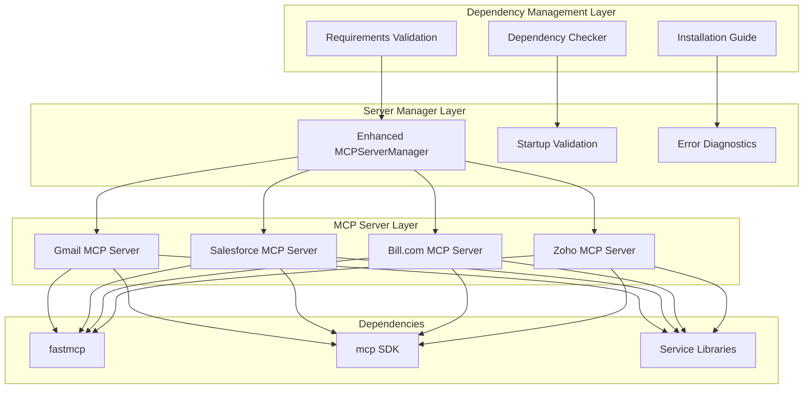

# MCP Server Dependency Fix Design

## Overview

This design document addresses the critical issue where MCP servers fail to start due to missing dependencies, specifically the `fastmcp` library. The current system has MCP server files that import `fastmcp` but this dependency is not included in the main requirements file, causing import errors when attempting to start servers through the test manager.

The solution involves adding missing dependencies to the requirements file, creating a dependency validation system, and enhancing the server manager to provide better error handling and diagnostics when dependency issues occur.

## Architecture

### Current State Analysis

**Problem Identification:**
- MCP servers import `fastmcp` but it's not in `backend/requirements.txt`
- The system has `mcp>=1.24.0` but not `fastmcp` which is a different package
- Server startup fails with `ModuleNotFoundError: No module named 'fastmcp'`
- No dependency validation before attempting to start servers

**Affected Components:**
- `src/mcp_server/gmail_mcp_server.py` - imports FastMCP
- `src/mcp_server/salesforce_mcp_server.py` - imports FastMCP  
- `src/mcp_server/mcp_server.py` - imports FastMCP and JWTVerifier
- `backend/test_mcp_server_manager.py` - fails when testing server startup

### Target Architecture



**Key Improvements:**

1. **Complete Dependency Management**: Add all missing packages to requirements.txt
2. **Pre-startup Validation**: Check dependencies before attempting to start servers
3. **Enhanced Error Handling**: Provide actionable error messages for missing dependencies
4. **Diagnostic Tools**: Help developers identify and resolve dependency issues

## Components and Interfaces

### 1. Enhanced Requirements Management

**Updated requirements.txt:**
```text
# Existing dependencies...
fastapi>=0.104.0,<0.105.0
uvicorn[standard]>=0.24.0,<0.25.0
motor>=3.3.0,<4.0.0
pydantic>=2.5.0,<3.0.0
python-dotenv>=1.0.0,<2.0.0
httpx>=0.25.0,<0.26.0
langgraph>=0.2.0,<0.3.0
langchain>=0.3.0,<0.4.0
langchain-openai>=0.2.0,<0.3.0
langchain-anthropic>=0.2.0,<0.3.0
websockets>=12.0,<13.0
langextract>=0.1.0
google-generativeai>=0.3.0

# MCP (Model Context Protocol) SDK
mcp>=1.24.0,<2.0.0

# FastMCP for simplified MCP server creation
fastmcp>=0.1.0

# Service-specific dependencies
google-auth>=2.0.0,<3.0.0
google-auth-oauthlib>=1.0.0,<2.0.0
google-auth-httplib2>=0.2.0,<1.0.0
googleapis-common-protos>=1.60.0,<2.0.0

# File upload and parsing
python-docx>=1.1.0,<2.0.0
python-magic>=0.4.27,<0.5.0

# Configuration management
PyYAML>=6.0,<7.0
```

### 2. Dependency Validation System

```python
class DependencyValidator:
    """Validates that all required dependencies are available."""
    
    REQUIRED_PACKAGES = {
        'fastmcp': 'FastMCP library for MCP server creation',
        'mcp': 'Official MCP SDK',
        'google-auth': 'Google authentication for Gmail MCP server',
        'google-auth-oauthlib': 'OAuth2 flow for Google services',
        'pydantic': 'Data validation library',
        'asyncio': 'Async I/O support (built-in)'
    }
    
    def __init__(self):
        self.missing_packages = []
        self.available_packages = []
    
    def check_all_dependencies(self) -> Dict[str, bool]:
        """Check if all required packages are available."""
        results = {}
        
        for package, description in self.REQUIRED_PACKAGES.items():
            try:
                __import__(package)
                results[package] = True
                self.available_packages.append(package)
            except ImportError:
                results[package] = False
                self.missing_packages.append((package, description))
        
        return results
    
    def get_installation_command(self) -> str:
        """Generate pip install command for missing packages."""
        if not self.missing_packages:
            return "All dependencies are satisfied"
        
        packages = [pkg for pkg, _ in self.missing_packages]
        return f"pip install {' '.join(packages)}"
    
    def generate_diagnostic_report(self) -> str:
        """Generate detailed diagnostic report."""
        report = []
        report.append("=== MCP Server Dependency Report ===")
        report.append("")
        
        if self.available_packages:
            report.append("✅ Available packages:")
            for pkg in self.available_packages:
                report.append(f"   - {pkg}")
            report.append("")
        
        if self.missing_packages:
            report.append("❌ Missing packages:")
            for pkg, desc in self.missing_packages:
                report.append(f"   - {pkg}: {desc}")
            report.append("")
            report.append("📋 Installation command:")
            report.append(f"   {self.get_installation_command()}")
        
        return "\n".join(report)
```

### 3. Enhanced MCP Server Manager

```python
class EnhancedMCPServerManager(MCPServerManager):
    """Enhanced server manager with dependency validation."""
    
    def __init__(self):
        super().__init__()
        self.dependency_validator = DependencyValidator()
        self.startup_validation_enabled = True
    
    def validate_dependencies(self) -> bool:
        """Validate all dependencies before starting servers."""
        self.print_section("Validating Dependencies")
        
        results = self.dependency_validator.check_all_dependencies()
        
        if all(results.values()):
            print("✅ All dependencies satisfied")
            return True
        else:
            print("❌ Missing dependencies detected")
            print(self.dependency_validator.generate_diagnostic_report())
            return False
    
    def check_server_files_and_dependencies(self) -> Dict[str, Dict[str, bool]]:
        """Check both server files and dependencies."""
        results = {
            'files': self.check_server_files(),
            'dependencies': self.dependency_validator.check_all_dependencies()
        }
        
        return results
    
    def start_server_with_validation(self, server_id: str) -> Optional[subprocess.Popen]:
        """Start server with pre-startup validation."""
        if self.startup_validation_enabled:
            if not self.validate_dependencies():
                print(f"❌ Cannot start {server_id} - missing dependencies")
                return None
        
        return self.start_server(server_id)
    
    def start_all_servers_with_validation(self) -> Dict[str, bool]:
        """Start all servers with comprehensive validation."""
        self.print_section("Pre-startup Validation")
        
        # Check files
        file_results = self.check_server_files()
        missing_files = [k for k, v in file_results.items() if not v]
        
        if missing_files:
            print(f"❌ Missing server files: {missing_files}")
            return {server: False for server in self.server_configs.keys()}
        
        # Check dependencies
        if not self.validate_dependencies():
            return {server: False for server in self.server_configs.keys()}
        
        # Start servers
        return self.start_all_servers()
    
    def diagnose_startup_failure(self, server_id: str, process: subprocess.Popen) -> str:
        """Diagnose why a server failed to start."""
        config = self.server_configs[server_id]
        
        try:
            stdout, stderr = process.communicate(timeout=5)
            
            diagnosis = []
            diagnosis.append(f"🔍 Diagnosing {config['name']} startup failure:")
            diagnosis.append(f"   Exit code: {process.returncode}")
            
            if "ModuleNotFoundError" in stderr:
                diagnosis.append("   Issue: Missing Python dependencies")
                missing_module = stderr.split("No module named '")[1].split("'")[0]
                diagnosis.append(f"   Missing module: {missing_module}")
                diagnosis.append("   Solution: Install missing dependencies")
                diagnosis.append(f"   Command: pip install {missing_module}")
            
            elif "Permission denied" in stderr:
                diagnosis.append("   Issue: Permission denied")
                diagnosis.append("   Solution: Check file permissions")
                diagnosis.append(f"   Command: chmod +x {config['script']}")
            
            elif "FileNotFoundError" in stderr:
                diagnosis.append("   Issue: Server script not found")
                diagnosis.append(f"   Missing file: {config['script']}")
                diagnosis.append("   Solution: Verify server script exists")
            
            else:
                diagnosis.append("   Issue: Unknown startup failure")
                diagnosis.append(f"   Error output: {stderr[:200]}...")
            
            return "\n".join(diagnosis)
        
        except subprocess.TimeoutExpired:
            return f"🔍 {config['name']} startup timeout - process may be hanging"
```

## Data Models

### Dependency Status Model

```python
@dataclass
class DependencyStatus:
    """Status of a single dependency."""
    package_name: str
    is_available: bool
    version: Optional[str] = None
    description: str = ""
    installation_command: str = ""

@dataclass
class SystemDependencyReport:
    """Complete system dependency report."""
    all_satisfied: bool
    available_dependencies: List[DependencyStatus]
    missing_dependencies: List[DependencyStatus]
    installation_commands: List[str]
    diagnostic_summary: str
    timestamp: datetime
```

### Server Status Model

```python
@dataclass
class ServerStartupStatus:
    """Enhanced server startup status."""
    server_id: str
    server_name: str
    is_running: bool
    process_id: Optional[int] = None
    startup_time: Optional[datetime] = None
    dependencies_satisfied: bool = True
    files_exist: bool = True
    error_message: Optional[str] = None
    diagnostic_info: Optional[str] = None
```

## Correctness Properties

*A property is a characteristic or behavior that should hold true across all valid executions of a system-essentially, a formal statement about what the system should do. Properties serve as the bridge between human-readable specifications and machine-verifiable correctness guarantees.*

**Property 1: Dependency Availability Before Startup**
*For any* MCP server startup attempt, all required dependencies must be available in the Python environment before the server process is created
**Validates: Requirements 1.1**

**Property 2: FastMCP Import Success**
*For any* MCP server that imports fastmcp, the FastMCP class must load successfully without ModuleNotFoundError
**Validates: Requirements 1.2**

**Property 3: Pre-startup Validation Execution**
*For any* server startup request, dependency validation must run and return results before any server process creation is attempted
**Validates: Requirements 1.3**

**Property 4: Clear Error Messages for Missing Dependencies**
*For any* missing dependency detection, the error message must contain the package name and installation instructions
**Validates: Requirements 1.4**

**Property 5: Consistent Dependency Management**
*For any* set of MCP servers, they must all use the same dependency validation process and get consistent results
**Validates: Requirements 1.5**

**Property 6: Complete Requirements File**
*For any* package imported by MCP servers, it must be present in the requirements.txt file
**Validates: Requirements 2.1**

**Property 7: Version Compatibility**
*For any* MCP server, all required packages must be importable with the versions specified in requirements.txt
**Validates: Requirements 2.2**

**Property 8: Main Requirements Inclusion**
*For any* MCP-related package, it must be included in the main backend requirements.txt file
**Validates: Requirements 2.3**

**Property 9: Server Startup Success**
*For any* MCP server with satisfied dependencies, the server process must start successfully and remain running
**Validates: Requirements 3.2**

**Property 10: Server Responsiveness**
*For any* running MCP server, status checks must confirm the server is responsive and functional
**Validates: Requirements 3.3**

**Property 11: Clean Server Termination**
*For any* running MCP server, the stop operation must cleanly terminate the process without leaving zombie processes
**Validates: Requirements 3.4**

**Property 12: Detailed Error Information**
*For any* server startup failure, detailed error information must be provided for troubleshooting
**Validates: Requirements 3.5**

**Property 13: Diagnostic Command Functionality**
*For any* diagnostic command execution, it must provide useful information about dependency status
**Validates: Requirements 4.2**

**Property 14: Error Detection and Messaging**
*For any* dependency-related server startup failure, the system must detect the issue and provide actionable error messages
**Validates: Requirements 5.1**

**Property 15: Startup Prevention with Missing Dependencies**
*For any* dependency validation failure, server startup must be prevented and guidance must be provided
**Validates: Requirements 5.2**

**Property 16: Tool Availability Verification**
*For any* successfully started server, all expected tools must be available and functional
**Validates: Requirements 5.3**

**Property 17: Comprehensive Health Validation**
*For any* health check execution, both server process status and tool functionality must be validated
**Validates: Requirements 5.4**

**Property 18: Automatic Recovery Attempts**
*For any* recoverable failure condition, the system must attempt automatic recovery or restart procedures
**Validates: Requirements 5.5**

<function_calls>
<invoke name="prework">
<parameter name="featureName">mcp-server-dependency-fix

## Error Handling

### Dependency Error Types

```python
class DependencyError(Exception):
    """Base exception for dependency-related errors."""
    def __init__(self, message: str, package_name: str = None):
        self.package_name = package_name
        super().__init__(message)

class MissingDependencyError(DependencyError):
    """Raised when a required dependency is missing."""
    def __init__(self, package_name: str, description: str = ""):
        self.description = description
        message = f"Missing required dependency: {package_name}"
        if description:
            message += f" ({description})"
        super().__init__(message, package_name)

class DependencyVersionError(DependencyError):
    """Raised when dependency version is incompatible."""
    def __init__(self, package_name: str, required_version: str, actual_version: str):
        self.required_version = required_version
        self.actual_version = actual_version
        message = f"Incompatible version for {package_name}: required {required_version}, found {actual_version}"
        super().__init__(message, package_name)

class ServerStartupError(Exception):
    """Raised when server fails to start."""
    def __init__(self, server_name: str, reason: str, diagnostic_info: str = ""):
        self.server_name = server_name
        self.reason = reason
        self.diagnostic_info = diagnostic_info
        message = f"Failed to start {server_name}: {reason}"
        super().__init__(message)
```

### Error Recovery Strategies

1. **Missing Dependencies**: Provide installation commands and prevent startup
2. **Version Conflicts**: Suggest compatible versions and update instructions
3. **Server Startup Failures**: Diagnose root cause and provide specific solutions
4. **Import Errors**: Identify missing modules and provide installation guidance

### Logging Standards

```python
# Structured logging for dependency issues
{
    "timestamp": "2025-01-15T10:30:00Z",
    "level": "ERROR",
    "component": "dependency_validator",
    "operation": "check_dependencies",
    "missing_packages": ["fastmcp", "google-auth"],
    "installation_command": "pip install fastmcp google-auth",
    "server_affected": "gmail_mcp_server"
}

# Structured logging for server startup
{
    "timestamp": "2025-01-15T10:30:00Z",
    "level": "INFO",
    "component": "mcp_server_manager",
    "operation": "start_server",
    "server_id": "gmail",
    "server_name": "Gmail MCP Server",
    "process_id": 12345,
    "startup_time_ms": 1500
}
```

## Testing Strategy

### Unit Testing

**Test Categories:**
- Dependency validation functionality
- Error message generation and formatting
- Server startup and shutdown procedures
- Diagnostic command execution
- Requirements file parsing and validation

**Key Test Cases:**
```python
class TestDependencyManagement:
    def test_dependency_validation_with_all_packages_available(self):
        """Verify validation passes when all dependencies are installed."""
        
    def test_dependency_validation_with_missing_packages(self):
        """Verify validation fails and provides correct error messages."""
        
    def test_installation_command_generation(self):
        """Verify correct pip install commands are generated."""
        
    def test_requirements_file_completeness(self):
        """Verify requirements.txt contains all needed packages."""

class TestServerManager:
    def test_server_startup_with_valid_dependencies(self):
        """Verify servers start successfully when dependencies are satisfied."""
        
    def test_server_startup_prevention_with_missing_dependencies(self):
        """Verify servers don't start when dependencies are missing."""
        
    def test_diagnostic_information_generation(self):
        """Verify detailed diagnostics are provided for failures."""
        
    def test_clean_server_shutdown(self):
        """Verify servers terminate cleanly without zombie processes."""
```

### Property-Based Testing

**Property Test Implementation:**
- Generate random combinations of available/missing packages and verify validation behavior
- Test server startup with various dependency states
- Validate error message consistency across different failure scenarios
- Test diagnostic command output with different system states

**Test Configuration:**
- Minimum 100 iterations per property test
- Use hypothesis library for Python property testing
- Mock package imports for controlled testing scenarios

### Integration Testing

**End-to-End Scenarios:**
- Complete dependency installation and server startup workflow
- Error recovery from missing dependencies to successful startup
- Multi-server startup with mixed dependency states
- Performance testing with dependency validation overhead

## Implementation Strategy

### Phase 1: Requirements File Update
1. Add missing dependencies to `backend/requirements.txt`
2. Verify version compatibility across all packages
3. Test installation in clean environment
4. Update Docker configuration if needed

### Phase 2: Dependency Validation System
1. Implement `DependencyValidator` class
2. Create diagnostic reporting functionality
3. Add installation command generation
4. Implement comprehensive error handling

### Phase 3: Server Manager Enhancement
1. Enhance `MCPServerManager` with validation
2. Add pre-startup dependency checks
3. Implement detailed error diagnostics
4. Add automatic recovery mechanisms

### Phase 4: Testing and Documentation
1. Create comprehensive test suite
2. Add integration tests for complete workflow
3. Update documentation with setup instructions
4. Create troubleshooting guide

## Configuration Management

### Requirements File Structure

```text
# backend/requirements.txt

# Core FastAPI and web framework
fastapi>=0.104.0,<0.105.0
uvicorn[standard]>=0.24.0,<0.25.0

# Database and data handling
motor>=3.3.0,<4.0.0
pydantic>=2.5.0,<3.0.0

# LangGraph and AI libraries
langgraph>=0.2.0,<0.3.0
langchain>=0.3.0,<0.4.0
langchain-openai>=0.2.0,<0.3.0
langchain-anthropic>=0.2.0,<0.3.0

# MCP (Model Context Protocol) libraries
mcp>=1.24.0,<2.0.0
fastmcp>=0.1.0

# Google services for Gmail MCP server
google-auth>=2.0.0,<3.0.0
google-auth-oauthlib>=1.0.0,<2.0.0
google-auth-httplib2>=0.2.0,<1.0.0
googleapis-common-protos>=1.60.0,<2.0.0
google-api-python-client>=2.0.0,<3.0.0

# Salesforce CLI integration
salesforce-cli>=1.0.0  # If available via pip

# HTTP and networking
httpx>=0.25.0,<0.26.0
websockets>=12.0,<13.0

# Utilities
python-dotenv>=1.0.0,<2.0.0
PyYAML>=6.0,<7.0
python-docx>=1.1.0,<2.0.0
python-magic>=0.4.27,<0.5.0

# AI and language processing
langextract>=0.1.0
google-generativeai>=0.3.0
```

### Environment Configuration

```bash
# .env file additions for MCP servers
MCP_SERVER_TIMEOUT=30
MCP_DEPENDENCY_CHECK_ENABLED=true
MCP_AUTO_INSTALL_MISSING=false
MCP_LOG_LEVEL=INFO
```

## Performance Considerations

### Dependency Validation Optimization
- Cache validation results to avoid repeated checks
- Implement lazy loading for dependency validation
- Use parallel validation for multiple packages
- Minimize startup overhead with efficient checking

### Server Startup Optimization
- Pre-validate dependencies once at system startup
- Use connection pooling for server processes
- Implement health check caching
- Optimize diagnostic information generation

## Security Considerations

### Dependency Security
- Pin dependency versions to prevent supply chain attacks
- Validate package integrity during installation
- Use secure package sources (PyPI with verification)
- Regular security audits of dependencies

### Server Process Security
- Run MCP servers with minimal privileges
- Isolate server processes from main application
- Secure stdio communication channels
- Validate all server inputs and outputs

## Deployment Guidelines

### Docker Configuration Updates

```dockerfile
# Dockerfile updates for MCP dependencies
FROM python:3.11-slim

# Install system dependencies
RUN apt-get update && apt-get install -y \
    build-essential \
    && rm -rf /var/lib/apt/lists/*

# Copy and install Python dependencies
COPY backend/requirements.txt /app/requirements.txt
RUN pip install --no-cache-dir -r /app/requirements.txt

# Verify MCP dependencies are installed
RUN python -c "import fastmcp; import mcp; print('MCP dependencies verified')"

# Copy application code
COPY . /app
WORKDIR /app

# Set up MCP server permissions
RUN chmod +x src/mcp_server/*.py

# Health check for MCP dependencies
HEALTHCHECK --interval=30s --timeout=10s --start-period=5s --retries=3 \
    CMD python -c "import fastmcp, mcp" || exit 1
```

### Environment-Specific Setup

**Development Environment:**
```bash
# Install dependencies
pip install -r backend/requirements.txt

# Verify MCP setup
python backend/test_mcp_server_manager.py

# Start servers
python backend/start_mcp_servers.py start
```

**Production Environment:**
```bash
# Use production requirements with pinned versions
pip install -r backend/requirements-prod.txt

# Verify installation
python -m backend.app.utils.dependency_validator

# Start with monitoring
python backend/start_mcp_servers.py start --monitor
```

This design provides a comprehensive solution to the MCP server dependency issues while establishing a robust foundation for dependency management and server lifecycle management.