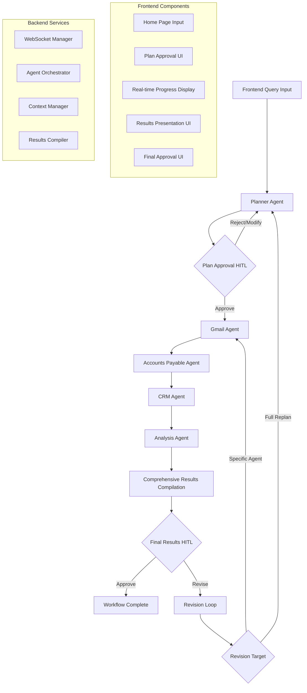

# Design Document: Multi-Agent Loop with Human-in-the-Loop

## Overview

This design implements a comprehensive multi-agent workflow with frontend integration and dual human-in-the-loop approval points. The system enables users to submit queries through the web interface, approve execution plans before agent execution, and review detailed results before final completion. The architecture supports: (1) frontend query submission, (2) Planner Agent HITL approval, (3) coordinated multi-agent execution (Gmail, Accounts Payable, CRM, Analysis), (4) verbose results compilation, and (5) final results HITL approval with iterative refinement capability.

## Architecture



### Comprehensive Workflow Flow

1. **Frontend Query Submission**: User types query in web interface
2. **Planner Analysis**: Planner Agent analyzes task and creates execution plan
3. **Plan Approval HITL**: User reviews and approves/modifies execution plan
4. **Multi-Agent Execution**: Sequential execution of Gmail → AP → CRM → Analysis agents
5. **Results Compilation**: System compiles comprehensive results with correlations
6. **Final Results HITL**: User reviews verbose results and approves/requests revisions
7. **Completion or Iteration**: Workflow completes or loops back based on user feedback

## Components and Interfaces

### Frontend Components

1. **Enhanced Home Page Input** (`HomePage.tsx`)
   - Query input field with comprehensive testing mode toggle
   - Team selection for multi-agent coordination
   - Submit button that initiates comprehensive workflow
   - Progress indicator for workflow stages

2. **Plan Approval UI** (`PlanApprovalDisplay.tsx`)
   - Displays Planner Agent's execution plan
   - Shows agent sequence, estimated duration, and data sources
   - Approve/Reject buttons with modification options
   - Plan details with expandable sections

3. **Real-time Progress Display** (`PlanChat.tsx`)
   - Live agent execution status
   - Streaming results from each agent
   - Progress bar showing workflow completion
   - Agent-specific status indicators

4. **Comprehensive Results UI** (New Component: `ComprehensiveResultsDisplay.tsx`)
   - Tabbed interface showing results from each agent
   - Data correlation visualization
   - Executive summary and detailed findings
   - Metadata about data quality and sources

5. **Final Approval UI** (Enhanced `ClarificationUI.tsx`)
   - Displays comprehensive results for review
   - Approval/revision input with specific feedback targeting
   - Option to revise specific agents or full workflow
   - Export/save results functionality

6. **WebSocket Message Handlers** (`PlanPage.tsx`)
   - Enhanced message routing for new message types
   - Plan approval request handling
   - Final results approval handling
   - Progress update processing

### Backend Components

1. **Enhanced Agent Orchestrator** (`agent_service.py`)
   - Coordinates sequential multi-agent execution
   - Manages dual HITL approval points
   - Handles comprehensive workflow state
   - Implements revision targeting logic

2. **Plan Approval Manager** (New: `plan_approval_service.py`)
   - Processes Planner Agent output
   - Formats plan approval requests
   - Handles plan modifications and rejections
   - Manages plan approval state

3. **Comprehensive Results Compiler** (New: `results_compiler_service.py`)
   - Aggregates results from all agents
   - Performs data correlation analysis
   - Generates executive summaries
   - Calculates quality metrics and metadata

4. **Enhanced Context Manager** (`context_manager.py`)
   - Maintains comprehensive execution history
   - Stores agent results and correlations
   - Manages revision context and targeting
   - Preserves workflow state across iterations

5. **WebSocket Enhancement** (`websocket_service.py`)
   - New message types for plan approval and final results
   - Enhanced progress reporting
   - Comprehensive results streaming
   - Error handling for complex workflows

6. **Agent Coordination Layer** (New: `agent_coordinator.py`)
   - Manages agent execution sequence
   - Handles inter-agent data passing
   - Implements error recovery and retry logic
   - Coordinates with MCP servers

## Data Models

### Plan Approval Request Message
```typescript
{
    "type": "plan_approval_request",
    "data": {
        "plan_id": "uuid",
        "plan": {
            "description": "string",
            "agent_sequence": ["gmail", "accounts_payable", "crm", "analysis"],
            "estimated_duration": "number",
            "data_sources": ["email", "bill_com", "salesforce"],
            "complexity": "low | medium | high"
        },
        "timestamp": "ISO8601"
    }
}
```

### Plan Approval Response (from frontend)
```typescript
{
    "plan_id": "uuid",
    "approved": "boolean",
    "feedback": "string",  // Optional modification requests
    "modified_plan": {     // Optional modified execution plan
        "agent_sequence": ["string"],
        "skip_agents": ["string"]
    }
}
```

### Comprehensive Results Message
```typescript
{
    "type": "comprehensive_results_ready",
    "data": {
        "plan_id": "uuid",
        "results": {
            "gmail": {
                "status": "completed | error",
                "result": "string | object",
                "metadata": {
                    "service_used": "gmail_mcp | mock",
                    "data_quality": "high | medium | low",
                    "execution_time": "number"
                }
            },
            "accounts_payable": {
                "status": "completed | error",
                "result": "string | object",
                "metadata": {
                    "service_used": "bill_com_mcp | mock",
                    "data_quality": "high | medium | low",
                    "execution_time": "number"
                }
            },
            "crm": {
                "status": "completed | error", 
                "result": "string | object",
                "metadata": {
                    "service_used": "salesforce_mcp | mock",
                    "data_quality": "high | medium | low",
                    "execution_time": "number"
                }
            },
            "analysis": {
                "status": "completed | error",
                "result": "string",  // Comprehensive analysis text
                "metadata": {
                    "analysis_length": "number",
                    "correlation_score": "number",
                    "llm_used": "string"
                }
            }
        },
        "correlations": {
            "cross_references": "number",
            "data_consistency": "number",
            "vendor_mentions": "number",
            "quality_score": "number"
        },
        "executive_summary": "string",
        "recommendations": ["string"],
        "timestamp": "ISO8601"
    }
}
```

### Final Results Approval Request
```typescript
{
    "type": "final_results_approval_request",
    "data": {
        "plan_id": "uuid",
        "comprehensive_results": "ComprehensiveResults", // Full results object
        "question": "Please review the comprehensive analysis and approve or request revisions",
        "revision_options": {
            "full_replan": "boolean",
            "specific_agents": ["gmail", "accounts_payable", "crm", "analysis"],
            "analysis_only": "boolean"
        }
    }
}
```

### Final Results Approval Response
```typescript
{
    "plan_id": "uuid",
    "approved": "boolean",
    "revision_type": "none | full_replan | specific_agents | analysis_only",
    "target_agents": ["string"],  // If revision_type is specific_agents
    "feedback": "string",         // Specific revision instructions
    "export_results": "boolean"   // Whether to save/export results
}
```

### Enhanced Execution Context
```typescript
{
    "original_task": "string",
    "workflow_type": "comprehensive_testing",
    "execution_history": [
        {
            "iteration": "number",
            "stage": "plan_creation | plan_approval | agent_execution | results_compilation | final_approval",
            "agent": "string",
            "result": "string | object",
            "timestamp": "ISO8601",
            "user_feedback": "string"  // If applicable
        }
    ],
    "plan_approvals": [
        {
            "iteration": "number",
            "approved": "boolean",
            "feedback": "string",
            "timestamp": "ISO8601"
        }
    ],
    "final_approvals": [
        {
            "iteration": "number", 
            "approved": "boolean",
            "revision_type": "string",
            "feedback": "string",
            "timestamp": "ISO8601"
        }
    ]
}
```

### Progress Update Message
```typescript
{
    "type": "workflow_progress_update",
    "data": {
        "plan_id": "uuid",
        "current_stage": "plan_creation | plan_approval | gmail_execution | ap_execution | crm_execution | analysis_execution | results_compilation | final_approval | completed",
        "progress_percentage": "number",
        "current_agent": "string",
        "estimated_remaining": "number",  // seconds
        "completed_agents": ["string"],
        "pending_agents": ["string"]
    }
}
```

### Clarification Request Message (Legacy Support)
```typescript
{
    "type": "user_clarification_request",
    "data": {
        "request_id": "uuid",
        "plan_id": "uuid",
        "agent_result": "string",  // Result from specialized agent
        "question": "Please approve or provide revision",
        "timestamp": "ISO8601"
    }
}
```

### Clarification Response (Legacy Support)
```typescript
{
    "request_id": "uuid",
    "plan_id": "uuid",
    "answer": "string",  // "OK" for approval or revision text
    "is_approval": "boolean"
}
```

## Correctness Properties

A property is a characteristic or behavior that should hold true across all valid executions of a system—essentially, a formal statement about what the system should do. Properties serve as the bridge between human-readable specifications and machine-verifiable correctness guarantees.

### Property 1: Frontend Workflow Initiation
*For any* user query submitted through the frontend interface, the system SHALL accept the query, initiate the workflow, send it to the Planner Agent, and display plan creation progress.
**Validates: Requirements 1.1, 1.2, 1.3**

### Property 2: Plan Display Completeness
*For any* execution plan created by the Planner Agent, the system SHALL display the complete plan including agent sequence, estimated duration, data sources, and all required metadata.
**Validates: Requirements 1.4, 1.5, 2.2**

### Property 3: Plan Approval Gating
*For any* execution plan, the system SHALL pause execution, request human approval, prevent agent execution until approval is received, and proceed with agent execution only after approval.
**Validates: Requirements 2.1, 2.3, 2.5**

### Property 4: Sequential Multi-Agent Execution
*For any* approved execution plan, the system SHALL execute Gmail, Accounts Payable, CRM, and Analysis agents in sequence, display real-time progress, show results after each completion, and handle errors with user intervention options.
**Validates: Requirements 3.1, 3.2, 3.3, 3.4, 3.5**

### Property 5: Comprehensive Results Compilation
*For any* completed multi-agent execution, the system SHALL compile comprehensive results from all agents, include detailed output from each source system, show data correlations and cross-references, present final analysis with executive summary and recommendations, and include metadata about data quality and execution metrics.
**Validates: Requirements 4.1, 4.2, 4.3, 4.4, 4.5**

### Property 6: Final Approval Gating
*For any* comprehensive results compilation, the system SHALL pause execution, request final human approval, display all agent results and analysis, mark workflow as completed on approval, and maintain results in editable state during approval.
**Validates: Requirements 5.1, 5.2, 5.3, 5.5**

### Property 7: Revision Loop Capability
*For any* final approval request, when the user requests modifications, the system SHALL allow feedback input, loop back to appropriate agents based on revision type, and support unlimited revision iterations.
**Validates: Requirements 5.4, 10.1, 10.2, 10.3, 10.4, 10.5**

### Property 8: Legacy HITL Routing
*For any* specialized agent result in legacy mode, the system SHALL send the result to the HITL agent, generate clarification requests, complete tasks on approval, and handle revisions with context preservation.
**Validates: Requirements 6.1, 6.2, 6.3, 6.4**

### Property 9: Context Preservation Across Iterations
*For any* revision or loop iteration, the system SHALL preserve the original task description in execution history, provide access to previous execution history and context, process revisions with full context awareness, and maintain complete history of all iterations.
**Validates: Requirements 7.1, 7.2, 7.3, 7.4**

### Property 10: Configurable HITL Behavior
*For any* task configuration, the system SHALL complete after specialized agents when HITL is disabled, route through HITL agent when required, send appropriate clarification message types, and process responses with correct completion or loop-back behavior.
**Validates: Requirements 8.1, 8.2, 8.3, 8.4**

### Property 11: Clarification UI Functionality
*For any* clarification request, the system SHALL display text input field for user response, recognize approval keywords, capture revision text, handle retry button functionality, and show agent results for context.
**Validates: Requirements 9.1, 9.2, 9.3, 9.4, 9.5**

### Property 12: Plan Rejection Handling
*For any* plan approval request, when the user rejects the plan, the system SHALL provide plan modification options, allow task cancellation, and handle plan modifications appropriately.
**Validates: Requirements 2.4**

## Error Handling

### Frontend Error Handling
- If query submission fails: Display error message and allow retry
- If WebSocket connection drops: Attempt reconnection and show connection status
- If plan approval request fails: Show error and allow manual retry
- If results display fails: Show partial results with error indicators

### Backend Error Handling
- If Planner Agent fails: Send error message and allow query modification
- If agent execution fails: Display agent-specific error and offer retry options
- If MCP server unavailable: Fallback to mock mode with user notification
- If results compilation fails: Show partial results and compilation errors
- If clarification request fails to send: Log error and complete task with agent result
- If user response is malformed: Treat as approval (default safe behavior)
- If HITL agent fails: Skip HITL and complete with agent result

### Workflow Error Recovery
- Agent timeout: Allow user to retry specific agent or continue with available results
- Partial results: Compile available data and mark missing sources
- Network interruption: Preserve workflow state and resume on reconnection
- Invalid user input: Provide clear validation messages and input guidance

## Testing Strategy

### Unit Tests
- Test frontend query submission and validation
- Test plan approval UI components and interactions
- Test comprehensive results display and formatting
- Test WebSocket message handling for new message types
- Test agent orchestration and coordination logic
- Test results compilation and correlation analysis
- Test context preservation across workflow iterations
- Test error handling for each workflow stage

### Property-Based Tests
- Property 1: Frontend workflow initiation for all query types
- Property 2: Plan display completeness for all plan configurations
- Property 3: Plan approval gating for all approval scenarios
- Property 4: Sequential multi-agent execution for all agent combinations
- Property 5: Comprehensive results compilation for all result types
- Property 6: Final approval gating for all approval scenarios
- Property 7: Revision loop capability for all revision types
- Property 8: Legacy HITL routing for backward compatibility
- Property 9: Context preservation across all iteration patterns
- Property 10: Configurable HITL behavior for all configuration options
- Property 11: Clarification UI functionality for all interaction types
- Property 12: Plan rejection handling for all rejection scenarios

### Integration Tests
- End-to-end comprehensive workflow: Query → Plan Approval → Multi-Agent Execution → Final Approval → Complete
- Plan rejection flow: Query → Plan Creation → Plan Rejection → Plan Modification → Approval → Execution
- Final results revision flow: Complete Execution → Results Review → Revision Request → Targeted Re-execution → Final Approval
- Error recovery scenarios: Agent failures, network interruptions, timeout handling
- Mixed approval and revision scenarios across both HITL checkpoints
- Real MCP server integration with fallback to mock mode
- WebSocket message flow validation for all message types
- Frontend-backend integration across all workflow stages

### Performance Tests
- Multi-agent execution timing and resource usage
- WebSocket message throughput during streaming
- Results compilation performance with large datasets
- Frontend responsiveness during long-running workflows
- Memory usage during comprehensive result storage

### User Experience Tests
- Plan approval UI usability and clarity
- Results presentation readability and navigation
- Error message clarity and actionability
- Workflow progress indication accuracy
- Mobile and desktop responsive behavior

### Testing Framework
- Backend: pytest with property-based testing using Hypothesis
- Frontend: Vitest with React Testing Library
- Integration: Custom test harness with real MCP servers
- E2E: Playwright for full workflow testing
- Minimum 100 iterations per property test
- Real vs mock mode testing for all scenarios
