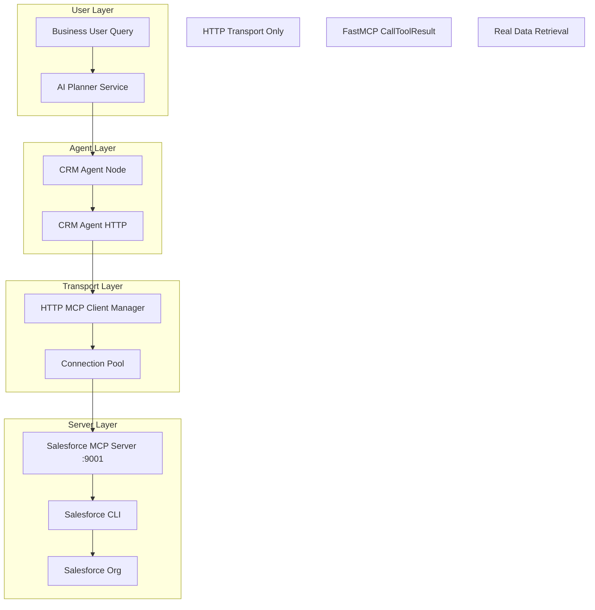

# Salesforce Agent HTTP Integration Design

## Overview

This design document outlines the technical implementation for migrating the Salesforce/CRM agent to use HTTP MCP transport, following the successful pattern established with the Bill.com agent integration. The solution ensures 100% reliability by replacing STDIO transport with HTTP transport, implementing proper tool mapping, and enabling real Salesforce data retrieval.

The design leverages the proven architecture from the Bill.com integration, including HTTP MCP client usage, FastMCP CallToolResult processing, and comprehensive error handling. This approach eliminates subprocess management conflicts and provides a robust foundation for CRM operations.

## Architecture

### Current State Analysis

**Existing CRM Agent HTTP Implementation:**
- ✅ `backend/app/agents/crm_agent_http.py` - Already uses HTTP MCP transport
- ✅ Uses `app.services.mcp_http_client.get_mcp_http_manager()`
- ✅ Supports multiple CRM services (Salesforce, HubSpot, Pipedrive, Zoho)
- ✅ Tool mapping configuration for Salesforce operations

**Salesforce MCP Server:**
- ✅ `src/mcp_server/services/salesforce_service.py` - Implements Salesforce tools
- ✅ Uses Salesforce CLI for SOQL queries and org management
- ✅ Supports both enabled and mock modes
- ⚠️ Needs validation for HTTP mode operation

**Integration Points:**
- ✅ `backend/app/agents/crm_agent_node.py` - LangGraph node with LLM integration
- ✅ AI Planner integration for CRM query routing
- ✅ WebSocket streaming for real-time responses

### Target Architecture



## Components and Interfaces

### CRM Agent HTTP (Existing - Validation Required)

**Location:** `backend/app/agents/crm_agent_http.py`

**Key Features:**
- HTTP MCP transport via `get_mcp_http_manager()`
- Multi-service support with tool mapping
- Comprehensive error handling
- FastMCP CallToolResult processing

**Tool Mapping Configuration:**
```python
'salesforce': {
    'name': 'Salesforce',
    'tools': {
        'get_accounts': 'salesforce_get_accounts',
        'get_opportunities': 'salesforce_get_opportunities', 
        'get_contacts': 'salesforce_get_contacts',
        'search_records': 'salesforce_search_records',
        'run_soql_query': 'salesforce_soql_query',
        'list_orgs': 'salesforce_list_orgs'
    }
}
```

### Salesforce MCP Server (Validation Required)

**Location:** `src/mcp_server/services/salesforce_service.py`

**Current Implementation:**
- Uses FastMCP `@mcp.tool()` decorators
- Salesforce CLI integration for queries
- Mock data support when disabled
- 6 registered tools

**Required Validation:**
- HTTP mode startup on port 9001
- Tool registration and accessibility
- Salesforce CLI authentication
- Real data retrieval capability

### CRM Agent Node (LangGraph Integration)

**Location:** `backend/app/agents/crm_agent_node.py`

**Features:**
- LLM-based intent analysis
- Robust parameter validation
- WebSocket streaming support
- Comprehensive error handling

**LLM Integration Flow:**
1. Analyze user intent with LLM
2. Validate and sanitize parameters
3. Execute CRM operations via HTTP agent
4. Format results with LLM analysis

## Data Models

### CRM Operation Request
```python
@dataclass
class CRMOperationRequest:
    operation: str  # get_accounts, get_opportunities, etc.
    service: str = 'salesforce'
    parameters: Dict[str, Any] = field(default_factory=dict)
    limit: int = 5
    account_name: Optional[str] = None
    stage: Optional[str] = None
    search_term: Optional[str] = None
    soql_query: Optional[str] = None
```

### Salesforce Response Format
```python
@dataclass
class SalesforceResponse:
    success: bool
    totalSize: int
    records: List[Dict[str, Any]]
    error: Optional[str] = None
```

### FastMCP CallToolResult Processing
```python
def _process_mcp_result(self, result: Any) -> Dict[str, Any]:
    """Process MCP CallToolResult into standard format."""
    if hasattr(result, 'structured_content') and result.structured_content:
        return result.structured_content
    elif hasattr(result, 'data') and result.data:
        return {"result": result.data}
    elif isinstance(result, dict):
        return result
    else:
        return {"result": str(result)}
```

## Correctness Properties

*A property is a characteristic or behavior that should hold true across all valid executions of a system-essentially, a formal statement about what the system should do. Properties serve as the bridge between human-readable specifications and machine-verifiable correctness guarantees.*

### Property 1: HTTP Transport Consistency
*For any* CRM agent initialization, the agent should use HTTP MCP transport exclusively and never use STDIO transport
**Validates: Requirements 1.1, 1.2**

### Property 2: FastMCP Result Processing
*For any* MCP response received, the CRM agent should correctly process FastMCP CallToolResult format and extract structured content
**Validates: Requirements 1.3**

### Property 3: Connection Pool Efficiency
*For any* sequence of CRM operations, the HTTP client should reuse connections efficiently and maintain connection pooling
**Validates: Requirements 1.4**

### Property 4: Server Port Binding
*For any* Salesforce MCP server startup, the server should successfully bind to port 9001 and respond to health checks
**Validates: Requirements 2.1, 2.2**

### Property 5: Tool Name Mapping Accuracy
*For any* CRM agent operation, the correct Salesforce tool name should be mapped (e.g., get_accounts → salesforce_get_accounts)
**Validates: Requirements 3.1, 3.2, 3.3, 3.4, 3.5**

### Property 6: Parameter Validation
*For any* tool call with parameters, required parameters should be validated before MCP calls and optional parameters should be included appropriately
**Validates: Requirements 3.6, 3.7**

### Property 7: Real Data Retrieval
*For any* successful CRM operation, the response should contain real Salesforce data with expected fields (names, amounts, dates, etc.)
**Validates: Requirements 4.1, 4.2, 4.3, 4.4, 4.5**

### Property 8: Data Formatting Consistency
*For any* CRM response containing monetary amounts or dates, the data should be formatted with proper currency symbols and readable date formats
**Validates: Requirements 4.6, 4.7**

### Property 9: AI Planner CRM Recognition
*For any* CRM-related query, the AI Planner should identify it as CRM-related with >90% accuracy and select the CRM agent
**Validates: Requirements 5.1, 5.2, 5.3**

### Property 10: Multi-Operation Support
*For any* supported CRM operation (accounts, opportunities, contacts, search, SOQL), the CRM agent should execute it successfully with appropriate parameters
**Validates: Requirements 6.1, 6.2, 6.3, 6.4, 6.5**

### Property 11: Error Message Clarity
*For any* error condition (connection failure, authentication failure, invalid parameters), the system should provide clear, actionable error messages
**Validates: Requirements 7.1, 7.2, 7.3, 7.4, 7.7**

### Property 12: Retry Logic Robustness
*For any* temporary failure or timeout, the system should handle it gracefully with appropriate retry logic
**Validates: Requirements 7.5, 8.3**

### Property 13: Performance Requirements
*For any* CRM operation under normal conditions, the system should complete it within 2 seconds on average
**Validates: Requirements 8.1**

### Property 14: Concurrent Request Handling
*For any* set of concurrent CRM requests, the system should handle them without performance degradation
**Validates: Requirements 8.2**

### Property 15: Reliability Threshold
*For any* extended period of CRM operations, the system should maintain >95% success rate
**Validates: Requirements 8.4**

## Error Handling

### HTTP Transport Errors
- **Connection Failures**: Retry with exponential backoff, clear error messages
- **Timeout Handling**: Configurable timeouts with graceful degradation
- **Server Unavailable**: Health check validation, fallback to mock data if configured

### Salesforce-Specific Errors
- **Authentication Failures**: Clear credential validation messages
- **CLI Errors**: Salesforce CLI error translation to user-friendly messages
- **SOQL Errors**: Query syntax validation and error reporting
- **Rate Limiting**: Automatic retry with appropriate delays

### Parameter Validation Errors
- **Missing Required Parameters**: Specific field validation messages
- **Invalid Parameter Types**: Type conversion and validation
- **Parameter Range Validation**: Limit validation for numeric parameters

## Testing Strategy

### Unit Testing
- **HTTP Client Integration**: Test HTTP MCP client usage and connection handling
- **Tool Mapping Validation**: Test correct tool name mapping for all operations
- **Parameter Processing**: Test parameter validation and sanitization
- **Error Handling**: Test error scenarios and message formatting

### Property-Based Testing
- **Tool Mapping Consistency**: Test that all CRM operations map to correct Salesforce tools
- **Parameter Validation**: Test parameter validation across all operation types
- **Data Format Consistency**: Test that responses maintain consistent formatting
- **Error Handling Robustness**: Test error handling across various failure scenarios

### Integration Testing
- **Salesforce MCP Server**: Test server startup, tool registration, and health checks
- **Real Data Retrieval**: Test actual Salesforce data retrieval and processing
- **AI Planner Integration**: Test complete workflow from query to result
- **Concurrent Operations**: Test multiple simultaneous CRM operations

### End-to-End Testing
- **Complete Workflow**: Test user query → AI Planner → CRM Agent → Salesforce → Response
- **Multi-Operation Scenarios**: Test complex scenarios requiring multiple CRM operations
- **Error Recovery**: Test system behavior during various error conditions
- **Performance Testing**: Test response times and throughput under load

**Testing Configuration:**
- Minimum 100 iterations per property test
- Each property test references its design document property
- Tag format: **Feature: salesforce-agent-http-integration, Property {number}: {property_text}**

### Test Data Requirements
- **Salesforce Org Access**: Valid Salesforce org with test data
- **Sample Accounts**: Accounts with various industries and revenue amounts
- **Sample Opportunities**: Opportunities in different stages with amounts and dates
- **Sample Contacts**: Contacts associated with accounts with email and title data
- **SOQL Test Queries**: Valid SOQL queries for testing custom query functionality